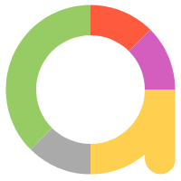

# Hello world, I'm Muhammad Fajar B 🐼
## I'm Programmer, Researcher, Lecturer
### Here is About me:


<br>- ⚡ I’m interested in the field of automation testing, computer vision, machine learning
<br>- 🎯 I’m currently teaching Bachelor Degree in [UNM][unm] as Lecturer
<br>- 📍 Makassar, Indonesia 🇮🇩

<br><br>

## Reach me:
[][linkedin]
[][youtube]
[][telegram]
[][instagram]
[][facebook]
[][medium]


<br><br><br><br><br><br><br><br>

## Language and Tools:

[][vscode]
[][intellij]
[][java]
[][testng]
[][restassured]
[][selenium]
[][cucumber]
[][appium]
[][allure]
[][docker]
[][jenkins]
[][git]
[][postman]
[][jira]
[][mysql]
[][php]
[][python]
<br/><br/>

## Experience
- ☑️ Automation & Manual Testing
```ruby
- API Testing (Cucumber, Java, JUnit, TestNG, Rest-Assured, Allure, Postman)
- Web UI Testing (Cucumber, Java, Selenium)
- Mobile Testing (Cucumber, Java, Appium)
- CI/CD Integration
- Smoke Test, Regression Test (Automation & Manual)
- Automation pipeline [Github Action for api & web] and [Jenkins for iOS & Android]
```
- ☑️ Programmer
```ruby
- Object Oriented Programming (OOP)
- PHP
- Java
- Python
- SQL & NoSQL
- REST API
- PHP Framework (Laravel, CodeIgniter, etc.)
- VueJS
```


[unm]: https://unm.ac.id/
[linkedin]: https://www.linkedin.com/in/muhammadfajarb
[youtube]: https://www.linkedin.com/in/muhammadfajarb
[telegram]: https://www.linkedin.com/in/muhammadfajarb
[instagram]: https://www.instagram.com/muhammadfajarb
[facebook]: https://www.instagram.com/muhammadfajarb

[vscode]: https://code.visualstudio.com/
[git]: https://git-scm.com/
[appium]: http://appium.io/
[selenium]: https://www.selenium.dev/
[cucumber]: https://cucumber.io/
[java]: https://www.java.com/
[php]: https://www.php.net/
[python]: https://www.python.org/
[testng]: https://testng.org/doc
[restassured]: https://rest-assured.io/
[allure]: https://docs.qameta.io/allure/
[jenkins]: https://www.jenkins.io/
[docker]: https://www.docker.com/
[intellij]: https://www.jetbrains.com/idea/
[postman]: https://www.postman.com/
[jira]: https://www.atlassian.com/software/jira
[medium]: https://medium.com/@muhammadfajarb
[mysql]: https://www.mysql.com/
[github]: https://github.com/muhammadfajarb